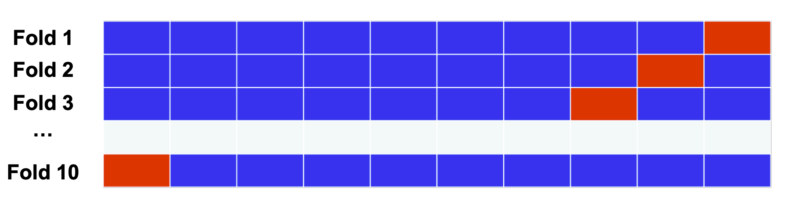

# foodpanda MLE Take Home Technical

Author: Mengyong Lee | [LinkedIn](https://www.linkedin.com/in/mylee1/) | [Github](https://github.com/mylee16)

<p align="center">
  
  <br>                  
</p>

## Table of contents
1. [Introduction](#introduction)
1. [Usage](#usage)
1. [Exploratory Data Analysis](#exploratory-data-analysis)
1. [Model Validation](#model-validation) 
1. [Metrics - ROC AUC](#metrics-roc-auc) 
1. [Model Performance](#model-performance)
1. [Insights](#insights)
1. [Future Work](#future-work)
1. [References](#references)

## Introduction
In this assessment, we aim to accurately predict the probability that somebody will experience distress in the next two years through loan default. Eventually, we achieve rank 53 on the public leaderboard. 

This task is based on [Kaggle Competition - Give Me Some Credit](https://www.kaggle.com/c/GiveMeSomeCredit/overview)

The codebase is written in python 3.6.7. The model is based on [sklearn](https://scikit-learn.org/stable/) implementation of [Gradient Booting Classifier](https://machinelearningmastery.com/gentle-introduction-gradient-boosting-algorithm-machine-learning/) and [Random Forest Classifier](https://towardsdatascience.com/understanding-random-forest-58381e0602d2).

Overall, 2 models were considered, namely:
 1. Random Forest Classifier
 2. Gradient Boosting Classifier
 
Of both models, 2. Gradient Boosting Classifier performed better in terms of both ROC and Accuracy. 
Gradient Boosting Classifier is implemented in [src](/src). 

## Usage
1. To build the environment:
```pip install -r requirements.txt```
2. To train the model:
```python -m src.train```
3. Prediction output will be stored in `output/submission.csv`

 Configuration files for src/train can be found in [src/config](/src/config). [src](/src) supports both RandomForestClassifier and XGBoost, to change model, simply update [src/config](/src/config).

## Exploratory Data Analysis
Exploratory Data Analysis notebook can be found in [1_eda.ipynb](notebooks/1_eda.ipynb)

## Model Validation
Stratified-Kfold is used during model validation. Stratified-Kfold (K=5) divides the entire dataset into 5 different portions. Each portion of the fold have equal proportion of each class. The model is then trained 5 times, with each training cycle being trained on 4 portion of the data, while being evaluated on the remaining 1 portion. The average score is then taken as the overall performance.

Stratified-Kfold (K=5) is chosen over traditional train-val-test split for a couple of reasons. First, stratified-kfold provides a more accurate representation of model performance. By training and evaluating the model 5 times, each data point have an equal chance of being chosen as the train set and the test set, negating any bias that results from train-test split.

Secondly, since Stratified-Kfold provides a more accurate metrics, we do not have to slice out an extra portion to be used in test data. This allow us to use more data during training.

Lastly, we are able to overcome one huge drawback of Stratified K-fold which is computation. Instead of training the model 1 time, to use stratified k-fold we have to train the model 5 times. In this case, as model training is relatively fast, we are not limited by computation.

<p align="center">
  
  <br>                  
</p>

## Metrics - ROC AUC
ROC AUC stands for Receiver Operating Characteristic - Area Under Curve. The ROC curve is a graph showing the performance of a classification model at all classification thresholds. The curve consist of two parameters - True Positive Rate, and False Positive Rate. While AUC represents the Area under the ROC Curve.

<p align="center">
  
  <br>                  
</p>
 
The difference between ROC AUC vs other metrics such as Accuracy or F1 is that ROC chooses the best model, before any threshold tuning. In a classification scenario, it is possible to tune the threshold in order to predict more positive class, or more negative class. Hence, it is possible for a model to produce many different Accuracy or F1, depending on threshold tuning. 

ROC AUC gets the performance of the model before any threshold tuning by looking at the trade off between True Positive Rate and False Positive Rate. A model with high ROC AUC means that the model performs well in all threshold tuning, and hence could be tuned to maximize any metrics, such as accuracy, F1/F0.5/F2. 

### Other Suggested Metrics - F2.0
In a situation of imbalance dataset - where only 6.7% positive class, it is useful to use a metric that takes into account both precision and recall, such as F-Score. A naive metric such as Accuracy will give a high score of 93.3% when a bad algorithm classify all instances as 0 (no loan default). 

In addition, a bank might be more interested in correctly classifying all loan default - favoring recall over precision, such as F2. 

<p align="center">
  
  <br>                  
</p>
 

## Model Performance
We tried two different approaches, Random Forest and Gradient Boosting Classifier.

- Random Forest
    - Provides a fast iteration if ensemble tree methods work on this dataset. With minimal tuning, we were able to achieve an ROC of 0.84351 (Private Score) using random forest. With further hyper parameter tuning, we are able to achieve a public AUC score of 0.86015 (rank 190) and private AUC score of 0.86582 AUC (rank 187). 

- Gradient Boosting Classifier (XGBoost)
     - Gradient Boosting Classifier is a more sophisicated form of random forest. XGBoost is used as random forest was not able to break through top 100 rank. With extensive parameter tuning, XGBoost was able to achieve a public score of 0.86211 (rank 53) and private score of 0.86728 (rank 96)


<p align="center">
  
  <br>                  
</p>

## Insights
Based on permutation importance, the most important feature is `NumberOfTimes90DaysLate`, `NumberOfTimes30-59DaysPastDueNotWorst`, and `NumberofTime60-89DaysPastDueNotWorse`, `RevolvingUtilizationOfUnsecuredLine`, and `Debt Ratio`. This makes sense, as people who have late payment issues and people with many unsecured line before are most likely to default.

On the other hand, `MonthlyIncome`, `NumberofDependent`, and `NumberofRealEstateLoans` have the lowest permutation importance. Interestingly, people with high number of dependent, low monthly income, or have many real estate loans do not default as often. Financial conditions seems to be not highly correlated to financial prudence. 


<p align="center">
  
  <br>                  
</p>


## Future Work
- [ ] Trying of more models: Adaboost, Catboost, Light Gradient Boosting, Neural Network
- [ ] Sampling algorithms such as SMOTE
- [ ] Ensemble of models to improve overall score 
- [ ] Hosting model and creating an API to serve model predictions

## References
- [Kaggle Competition - Give Me Some Credit](https://www.kaggle.com/c/GiveMeSomeCredit/overview)
- [Scikit-learn](https://scikit-learn.org/stable/)
- [Tuning XG Boost](https://www.analyticsvidhya.com/blog/2016/02/complete-guide-parameter-tuning-gradient-boosting-gbm-python/)
